<p align="center">
  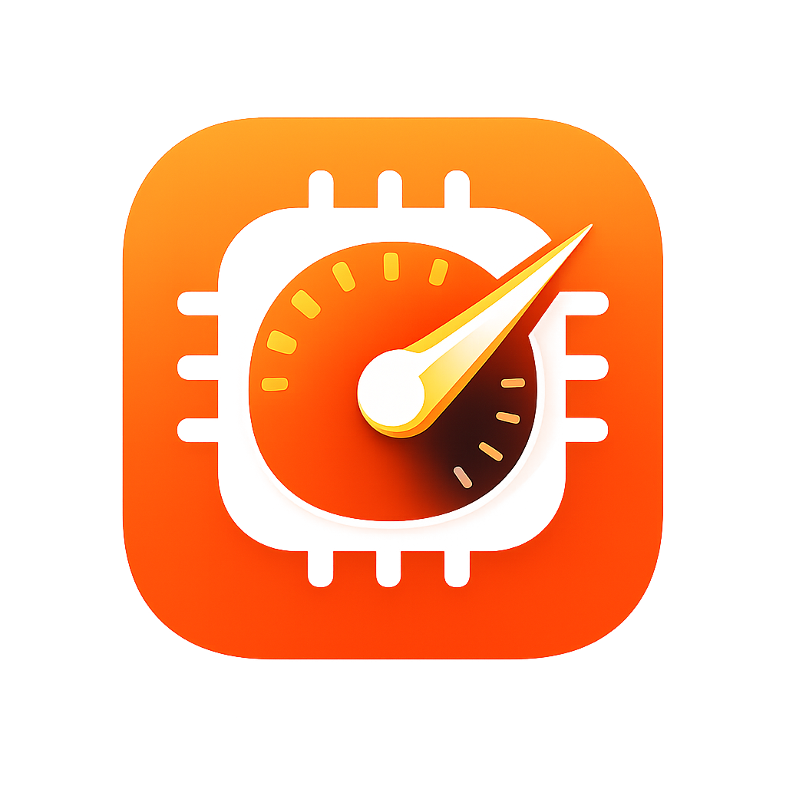
</p>

<h1 align="center">MacOptimizer Studio</h1>
<p align="center"><strong>Your Mac, But Faster</strong></p>

<p align="center">
  A native macOS system optimization app built with SwiftUI and a high-performance Rust disk scanner.<br>
  30+ tools to monitor, clean, and maintain your Mac from a single dashboard.
</p>

<p align="center">
  
  
  
  
</p>

<p align="center">
  <a href="https://github.com/sandeepshet7/MacOptimizerStudio/releases">Download</a> &middot;
  <a href="https://sandeepshet7.github.io/MacOptimizerStudio/">Website</a>
</p>

---

## Screenshots

| Home Dashboard | Quick Clean | Memory Monitor |
|:-:|:-:|:-:|
| 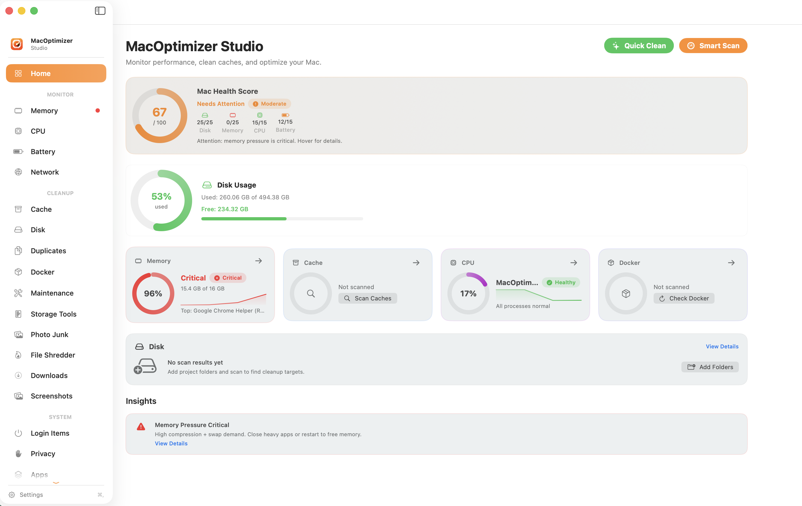 | 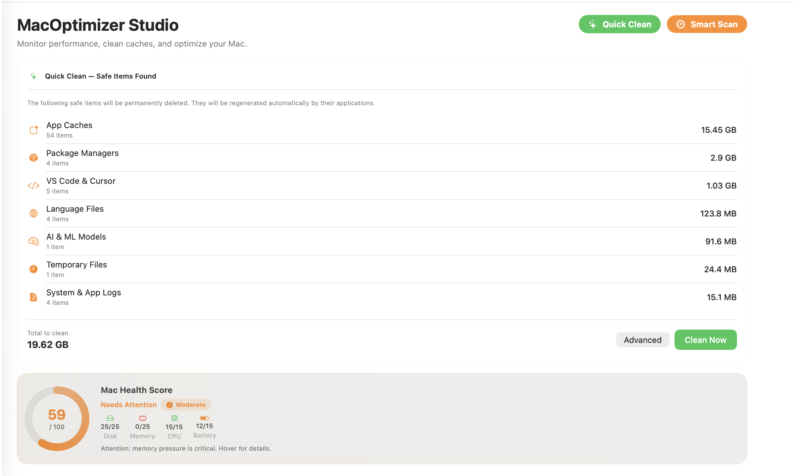 | 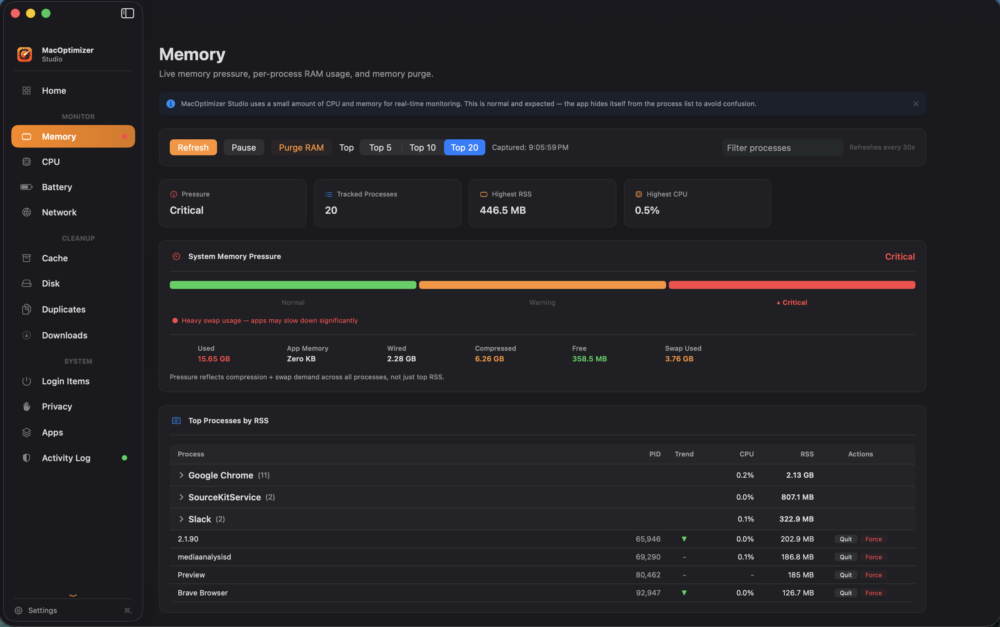 |

| Cache Cleanup | Disk Analysis | CPU Monitor |
|:-:|:-:|:-:|
| 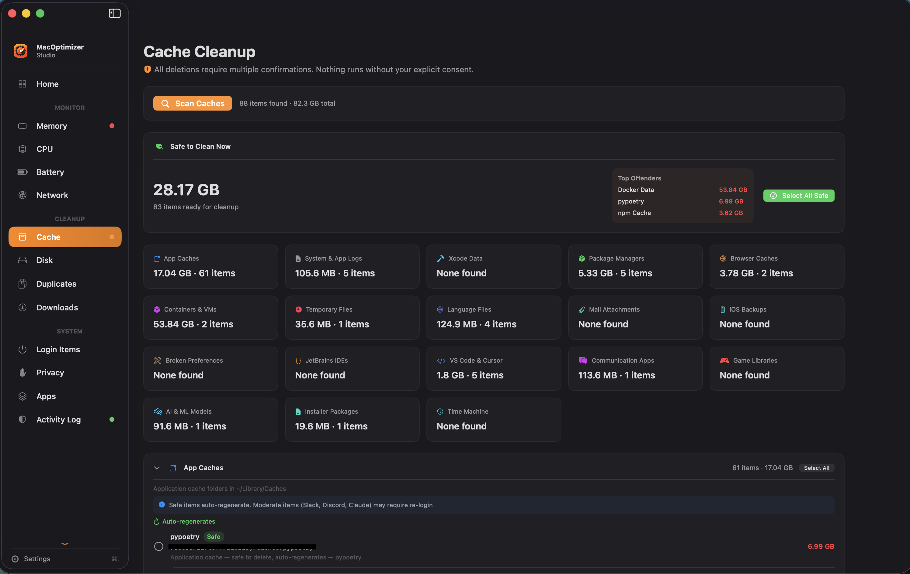 | 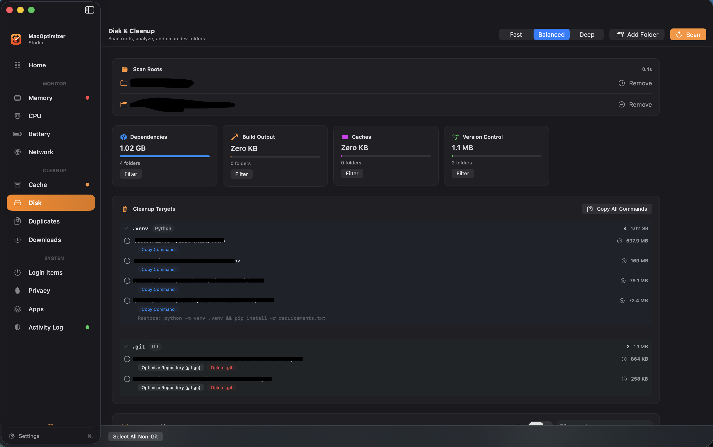 | 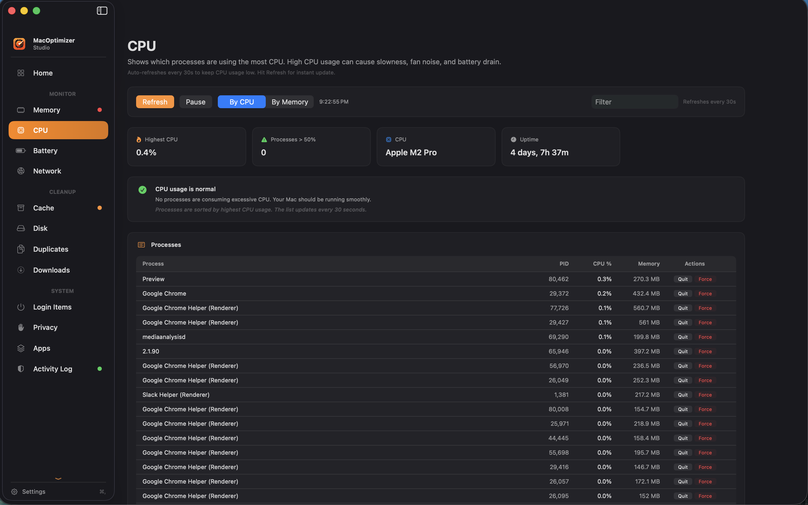 |

| Docker Management | Battery Monitor | Maintenance |
|:-:|:-:|:-:|
| 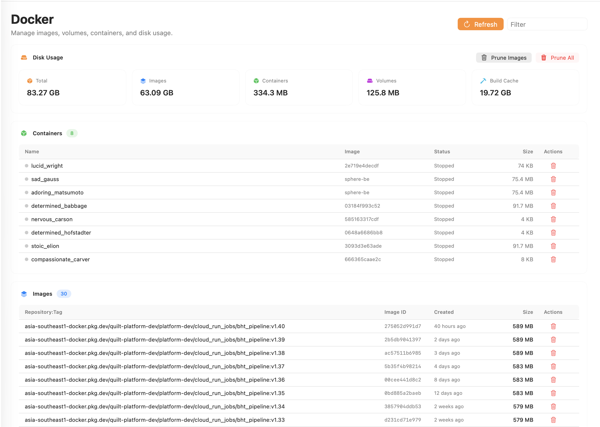 | 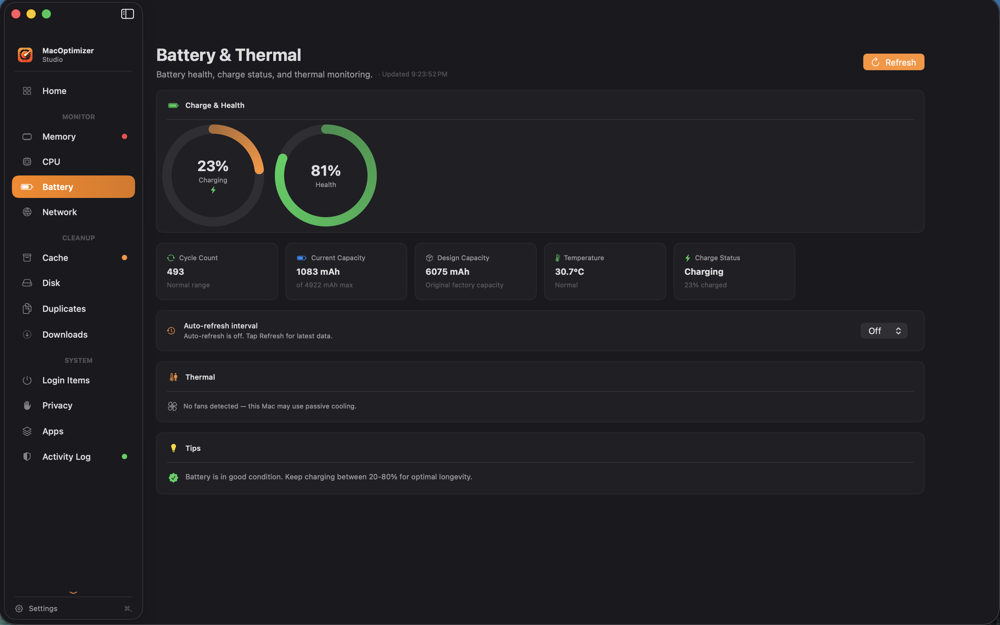 | 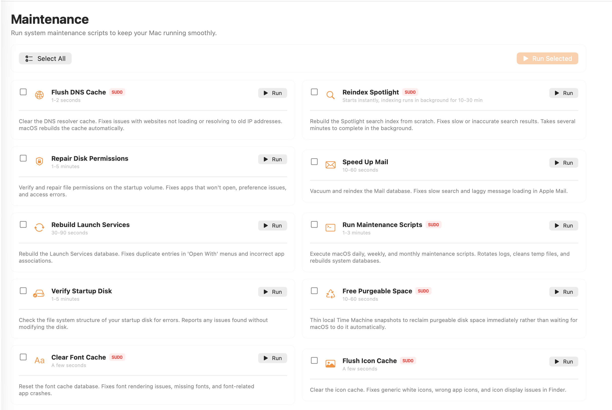 |

| Activity Log | | |
|:-:|:-:|:-:|
| 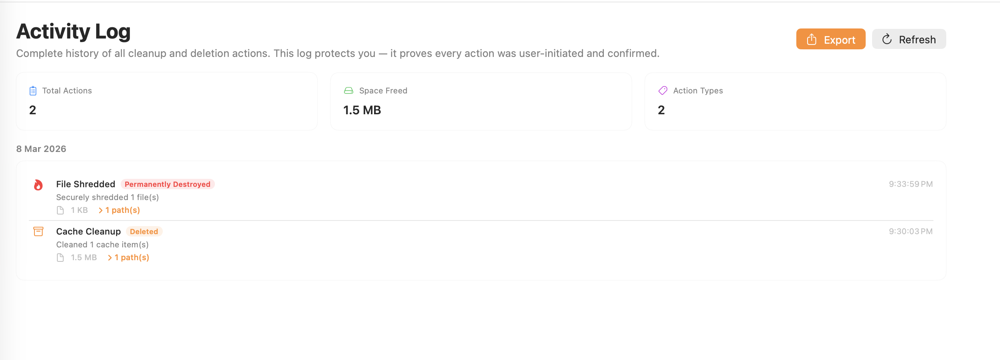 | | |

---

## Features

### Real-time Monitoring
- **Home Dashboard** -- Overview cards with system health insights, disk usage ring chart, and quick actions
- **Memory** -- Live memory pressure gauge, per-process RSS tracking, growing process detection
- **CPU** -- CPU-intensive process list with quit/force-quit, smart self-detection when scanning
- **Battery** -- Battery health %, charge cycles, thermal state, configurable auto-refresh (10s/30s/60s)
- **Network** -- Real-time upload/download bandwidth and active connections
- **Disk Health** -- S.M.A.R.T. monitoring for SSD/HDD status

### Scan & Cleanup
- **Quick Clean** -- One-click safe junk cleanup (caches, logs, temp files) with single confirmation
- **Cache Cleanup** -- 18 cache categories with smart risk levels:
  - App Caches, System Logs, Xcode Data, Package Managers (Homebrew, npm, pip, Conda, CocoaPods, Bun, Flutter)
  - Browser Caches, Containers & VMs (Docker, Parallels, VMware, UTM, VirtualBuddy)
  - JetBrains IDEs, VS Code & Cursor, Communication Apps (Slack, Discord, Teams, Zoom)
  - Game Libraries (Steam, Epic), AI & ML Models (Ollama, Hugging Face, LM Studio, PyTorch)
  - Installer Packages, Time Machine Snapshots, Temporary Files, Language Files
- **Disk Analysis** -- Rust-powered scan with sortable largest folders, drag-and-drop scan roots
- **Duplicate File Finder** -- SHA256-based detection with partial hash optimization (first 8KB + last 8KB)
- **Docker Management** -- Images, volumes, containers; bulk prune; disk usage stats
- **File Shredder** -- Secure 3x-overwrite deletion
- **Maintenance** -- System scripts (flush DNS, rebuild Spotlight, verify disk, repair permissions)

### Smart Safety
- Electron apps (Slack, Discord, Claude) marked as "Moderate" risk -- may require re-login after cleanup
- Pure caches (pip, Homebrew, Xcode DerivedData) marked as "Safe" -- auto-regenerate
- "Select All Safe" never touches login-sensitive data
- Every category shows "What breaks if deleted" info

### System & Privacy
- **Login Items Manager** -- Control startup agents and daemons
- **Privacy Scanner** -- Browser cache/cookie/history cleanup, app permission scanner
- **App Manager** -- Full app uninstaller with associated file detection
- **Extension Manager** -- Safari, QuickLook, input methods, screen savers
- **Screenshot Organizer** -- Find and clean up screenshots from Desktop/Downloads
- **Startup Time Analysis** -- Boot time analysis and startup contributors
- **Disk Benchmark** -- Sequential and random read/write speed tests
- **Audit Log** -- Full trail of all actions with timestamps, paths, bytes freed (exportable)

### Extras
- Menu bar widget with compact gauges (Memory, Disk, CPU) and quick actions
- 5-step onboarding wizard for new users
- Multi-step confirmation dialogs for all destructive actions
- Light / Dark / System theme support
- Keyboard shortcuts (Cmd+1..9)
- Settings with configurable poll intervals and scan presets

---

## Requirements

| | Minimum |
|---|---|
| **macOS** | 12 Monterey or later |
| **Hardware** | Intel Macs (2015+) or any Apple Silicon (M1--M5) |
| **Rust** | Required only for building the disk scanner from source |

---

## Installation

### Download (Recommended)

Download the latest `.dmg` from [Releases](https://github.com/sandeepshet7/MacOptimizerStudio/releases).

Since the app is unsigned, on first launch:
1. Drag MacOptimizer Studio to Applications
2. **Right-click → Open** (don't double-click)
3. Click "Open" on the macOS warning dialog
4. If blocked: **System Settings → Privacy & Security** → scroll down → click **"Open Anyway"**
5. You only need to do this once

### Build from Source

```bash
# Clone the repository
git clone https://github.com/sandeepshet7/MacOptimizerStudio.git
cd MacOptimizerStudio

# Build the Rust disk scanner
./scripts/build_rust_scanner.sh

# Run the app
MACOPT_SCANNER_PATH="$(pwd)/rust/macopt-scanner/target/debug/macopt-scanner" swift run MacOptimizerStudio
```

### Build for Distribution

Generate a standalone `.app`, `.zip`, and unsigned `.dmg`:

```bash
./scripts/package_clickable_app.sh
```

Artifacts are placed in `build/local-app/`:
- `MacOptimizerStudio.app`
- `MacOptimizerStudio.zip`
- `MacOptimizerStudio-unsigned.dmg`

---

## Tech Stack

| Layer | Technology |
|---|---|
| **UI** | SwiftUI, Swift 6.0 (strict concurrency) |
| **Disk Scanner** | Rust (`macopt-scanner`) -- fast parallel disk scanning |
| **Package Manager** | Swift Package Manager |
| **System APIs** | Darwin/libproc, FileManager, Process, IOKit |

---

## Project Structure

```
MacOptimizerStudio/
├── Sources/
│   ├── MacOptimizerStudio/           # SwiftUI views (35+ files)
│   │   ├── Assets.xcassets/          # App icons and colors
│   │   └── Resources/               # Bundled resources
│   └── MacOptimizerStudioCore/       # Business logic layer
│       ├── Models/                   # Data models
│       ├── ViewModels/               # View models
│       └── Services/                 # Services
├── rust/macopt-scanner/              # Rust disk scanner binary
├── scripts/
│   ├── build_rust_scanner.sh         # Build Rust component
│   ├── package_clickable_app.sh      # Build unsigned .app/.dmg
│   └── release_dmg.sh               # Signed/notarized .dmg (requires Developer ID)
├── Tests/                            # Unit tests
├── docs/                             # Landing page (GitHub Pages)
└── Package.swift                     # SPM configuration
```

---

## Safety

- Every destructive action requires multi-step confirmation
- Smart risk levels per cache item (Safe / Moderate / Caution)
- All operations are logged to the Audit Log with timestamps and file paths
- Audit trail is exportable as a text file

---

## Contributing

Contributions are welcome! To get started:

1. Fork the repository
2. Create a feature branch (`git checkout -b feature/your-feature`)
3. Make your changes and ensure tests pass (`swift test --disable-sandbox`)
4. Commit with a clear message describing the change
5. Open a pull request against `main`

---

## License

MIT License. See [LICENSE](LICENSE) for details.
